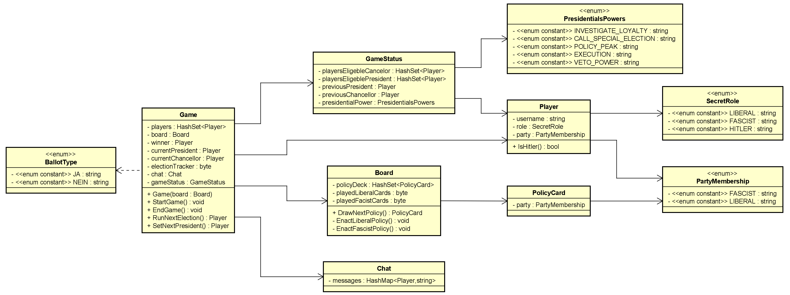
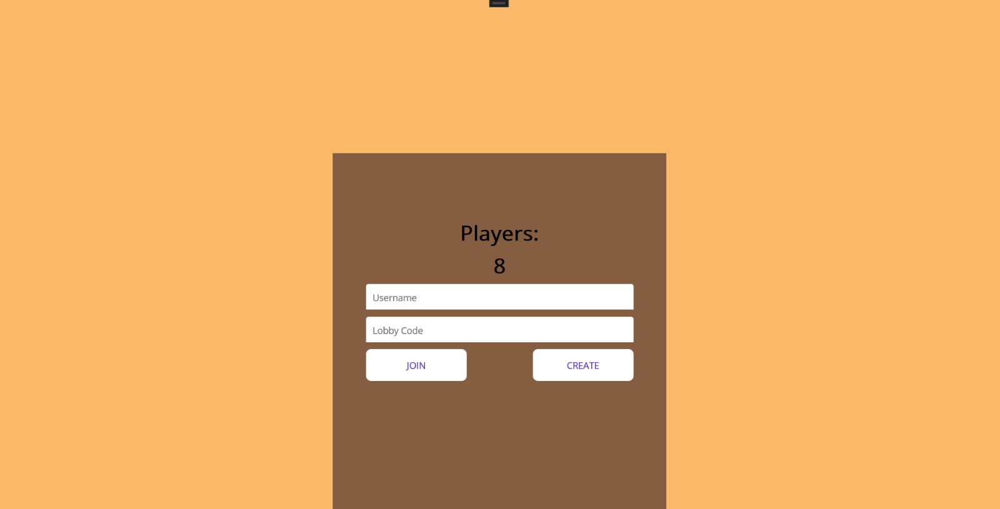
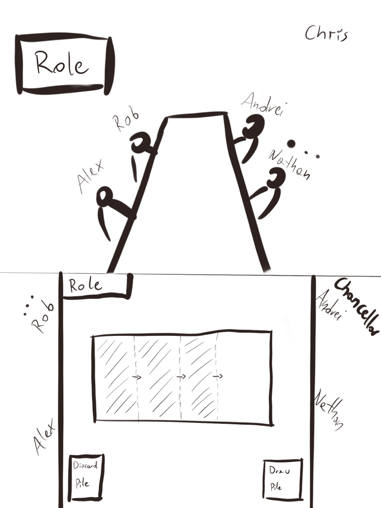

# Stealth Fuhrer - C# .NET MAUI

## Introduction

Stealth Fuhrer is a social deduction game for 5-10 people about finding and stopping Hitler and
a fascist before they take over the government. The game is set in 1930s Germany and revolves around
the political struggle between the liberal and fascist teams.

In "Stealth Fuhrer", players are randomly assigned roles as either liberals or fascists, with one player being
secretly designated as "Secret Hitler." The liberals' goal is to pass liberal policies and identify and
eliminate Hitler, while the fascists aim to pass fascist policies and help Hitler rise to power.

Throughout the game, players participate in rounds where they propose and vote on policies, while trying to
gather information about each other's allegiances. The game involves deception, negotiation, and deduction as
players attempt to gain control and achieve their objectives.

"Stealth Fuhrer" is typically played with a large group of people, making it a popular choice for parties and
social gatherings. It offers an engaging and immersive experience as players navigate the delicate balance
between trust and suspicion.

### *Based on "Secret Hitler" by Max Temkin, Mike Boxleiter, Tommy Maranges, and Mac Schubert*

We would like to acknowledge and give full credit to the original authors of "Secret Hitler,"
Max Temkin, Mike Boxleiter, Tommy Maranges, and Mac Schubert, for their innovative game design and concept.
Stealth Fuhrer is a clone of "Secret Hitler" and has been created with their game as a source of inspiration.

Please note that Stealth Fuhrer is not affiliated with or endorsed by the original creators of "Secret Hitler."

To learn more about the original game and its creators, please visit their official website:
https://www.secrethitler.com/.

### About the developers

This game is being developed part of the course "C#2" at NHL Stenden University of Applied Sciences.
Below you can find the team members:

|        Name        |
|:------------------:|
| Krystian Wiazowski |
| Alexandru Gumaniuc |
|    Rob Veldman     |
|    Nathan Mills    |
|  Andrei Khudiakov  |

## Description

This game will be an abbreviation of the original idea. The preview of the rules can be found
here: https://www.secrethitler.com/assets/Secret_Hitler_Rules.pdf.

*General specifications:*

* Card game
* 2D view point
* Multiplayer mode only (connected via the same LAN Network)
* To start, it will require a minimum of **5 people** and a maximum of **10 people**

### Class Diagram

### Design Mockups

#### Main Menu

#### Lobby

*When joining/creating a new game*

*After joining/creating a new game*

#### Game

#### Game - Voting

### MoSCoW Analysis

|  Priority   |                                                               Task                                                                |
|:-----------:|:---------------------------------------------------------------------------------------------------------------------------------:|
|  Must have  | Multiplayer mode Revealable role button Input Validation Policy Cards Role Cards  Ja/Nein Voting buttons  |
| Should have |                                         Popup messages Chancellor/President Icon                                          |
| Could have  |                                                  Animations Player Icon                                                   |
|  Wont have  |                                                            Player Chat                                                            |

## Input & Output

### Input

|          Case          |   Type   |          Conditions           |
|:----------------------:|:--------:|:-----------------------------:|
| PlayerShared Username  | `String` | 2 < `string` > 15, no symbols |
| PlayerShared LobbyCode | `String` | 4 < `string` > 6, no symbols  |
|                        |          |                               |

### Output

|        Case        |         Type         |
|:------------------:|:--------------------:|
|      Players       |       `Player`       |
|  CurrentPresident  |       `Player`       |
| CurrentChancellor  |       `Player`       |
|       Winner       |       `Player`       |
|       Party        |  `PartyMembership`   |
|      isHitler      |      `Boolean`       |
|  ElectionTracker   |        `Byte`        |
|        Role        |     `SecretRole`     |
|      isKilled      |      `Boolean`       |
| PresidentialPowers | `PresidentialPowers` |

### Calculations

|    Case    |    Calculation    |
|:----------:|:-----------------:|
| AssignRole | `Example*Example` |
|            |                   |

### Remarks

* Input will be validated
* Players with the same username cannot connect
* Lobby can be created only once with the same code

## Test Plan

In this section the testcases will be described to test the application.

### **Test Data**

In the following table you'll find all the data that is needed for testing.

#### Player, entering the game

|               ID               |       Input        |            Code             |
|:------------------------------:|:------------------:|:---------------------------:|
| playershared1(name, lobbycode) |   `Chris, 1234`    | PlayerShared("Chris", 1234) |
| playershared2(name,lobbycode)  |    empty, empty    |  PlayerShared(null, null)   |

### Test Cases

In this section the test cases will be described. Every test case should be executed with the test data as starting
point.

#### Test Case 1

Description: Testing input validation.

| Step | Input |        Action         |              Expected Output              |
|:----:|:-----:|:---------------------:|:-----------------------------------------:|
|  1   |       | setExample("Example") |                 `Example`                 |
|  2   |       |   setExample(null)    |                   null                    |
|  3   |       |    setExample(" ")    | `Example must be at least 2 letters long` |

#### Test Case 2

Description: Testing what if the player is killed

| Step | Input |        Action         |              Expected Output              |
|:----:|:-----:|:---------------------:|:-----------------------------------------:|
|  1   |       | setExample("Example") |                 `Example`                 |
|  2   |       |   setExample(null)    |                   null                    |
|  3   |       |    setExample(" ")    | `Example must be at least 2 letters long` |

#### Test Case 3

Description: User is Fuhrer